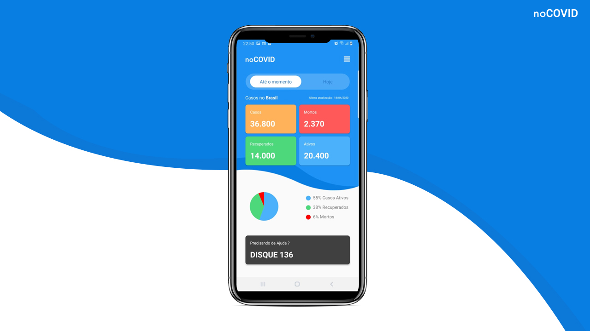

## Setup

Para a utilização do repositório é necessario ter instalado o React Native CLI e a SDK do Android para emular o dispositivo - [Tutorial](https://react-native.rocketseat.dev/).
```
yarn install && react-native start
```
<!-- CONTACT -->

## Imagens



## Como Utilizar

Por favor, na hora da criação da feature crie uma branch com o nome de feature/nome da feature.


## Api Utilizada

Atualmente estamos utilizando essa API, mas com possibilidade de troca da mesma, principalmente para uma que tenha dados de outras datas no Brasil e que as informações sejam verídicas.

```
https://corona.lmao.ninja/v2/countries/brazil
```

## Contato

Emanuel Ferreira - [Github](https://github.com/EmanuelCampos) - **contatoferreirads@gmail.com**
